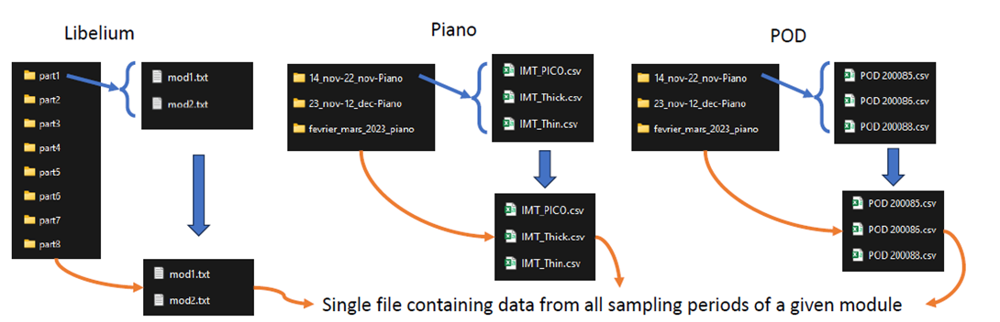
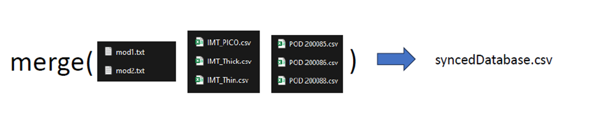

# Projet Data Science - Analyse de la Qualité de l'Air

Ce projet a pour objectif de découvrir toute la chaîne de travail d'un Data Scientist en réalisant une analyse de qualité de l'air.

## Structure du Projet

Le projet est organisé en trois répertoires principaux:

- `tache1/`: Contient les fichiers liés à la tâche 1.
  
  -> les fichiers existent déjà
- `tache2/`: Contient les fichiers liés à la tâche 2. (db_full.csv)
  
- `tache3/`: Contient les fichiers liés à la tâche 3. (le fichier de la BD avec les labels labels.csv)

Le rapport du projet est disponible dans le fichier `TP_AnalyseQualitAir.pdf`.
De plus, le dossier `TP Data 2024 - FISA` contient tous les fichiers initiaux nécessaires pour le projet.

## Scripts Python

- `seance1.py`: Ce script permet de répondre aux tâches 1 et 2 en rassemblant les données des modules en 8 fichiers, en effectuant le nettoyage et la synchronisation, et en fusionnant les données dans une seule base de données.
- `seance2.py`: Ce script répond à la tâche 3 en réalisant la segmentation de chaque activité, en ajoutant des labels et en calculant la signature moyenne.
- `seance3.py`: Ce script répond à la tâche 4 en appliquant notre méthodologie et en mesurant sa performance.

## Utilisation

Avant d'exécuter les scripts, assurez-vous d'installer les dépendances nécessaires en exécutant la commande suivante:

```bash
pip install -r requirements.txt
```

Ensuite, vous pouvez lancer chaque script avec Python en utilisant la commande suivante:

```bash
python seance1.py
python seance2.py
python seance3.py
```
